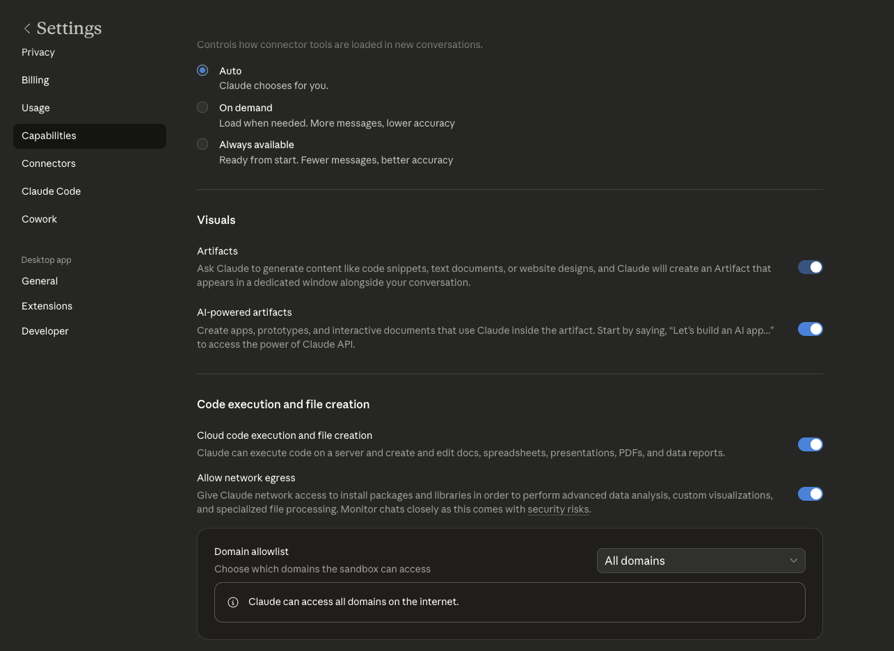

<p align="center">
  
</p>

<h1 align="center">Kon</h1>

<p align="center">
  Claude on your phone can now reach your computer.
</p>

<p align="center">
  <a href="https://www.npmjs.com/package/@schuttdev/kon"></a>
  <a href="https://www.npmjs.com/package/@schuttdev/gigai"></a>
</p>

---

Kon is a lightweight client that runs inside Claude's code execution sandbox. It connects over HTTPS to **gigai**, a server running on your machine that exposes tools — shell commands, filesystem access, MCP servers, scripts — through an authenticated API.

Install the server, paste one command into Claude, and anything you've allowed is now accessible from Claude on iOS, the web, or anywhere else you use claude.ai.


## Quickstart with Claude Code

If you have [Claude Code](https://docs.anthropic.com/en/docs/claude-code), it can handle the entire setup for you — installing dependencies, configuring Tailscale, picking tools, and starting the server.

```
/plugin install https://github.com/Kaden-Schutt/kon
/kon:gigai-setup
```

Claude Code will walk you through everything below (and help you manage your server after).

## Prerequisites

Before you start, you need two things:

**1. Tailscale**

Kon requires an HTTPS connection between Claude's sandbox and your machine. [Tailscale](https://tailscale.com/) with Funnel enabled is the recommended (and easiest) way to get this. Install Tailscale, create an account, and enable Funnel on your machine. The setup wizard handles the rest.

Platform-specific setup guides: [macOS](docs/setup-macos.md) | [Linux](docs/setup-linux.md) | [WSL](docs/setup-wsl.md) | [Docker](docs/setup-docker.md)

**2. Claude capabilities**

On claude.ai, go to **Settings > Capabilities** and configure the **Code execution and file creation** section:

<p align="center">
  
</p>

## Quickstart

### 1. Install the gigai server on your machine

```bash
npm install -g @schuttdev/gigai
```

### 2. Run the setup wizard

```bash
gigai init
```

Walks you through HTTPS setup (Tailscale Funnel recommended), port config, selecting built-in tools, scoping permissions, and starting the server. At the end, it gives you a code block to paste into Claude.

### 3. Paste into Claude

The setup wizard generates a prompt specifically for your server — paste it into Claude. It will look something like this:

```bash
npm install -g @schuttdev/kon
kon pair ABC123XY https://your-machine.tail1234.ts.net:7443
```

> **Don't paste the example above** — it won't work. Use the actual prompt from your setup wizard, which contains your real pairing code and server URL.

Claude will run the commands, generate a skill file, and prompt you to download it. Upload it to Claude as a skill (Settings > Customize > Upload Skill).

### 4. Use it

In any new conversation, the skill handles setup automatically. Then just ask Claude to do things:

> "List my home directory"
> "Run the tests in my project"
> "Search for TODO comments in ~/projects/myapp"

Claude runs `kon read ...`, `kon bash git ...`, etc. behind the scenes.

## How it works

```
kon (Claude's sandbox)  ──HTTPS──>  gigai (your machine)
                                         │
                                         ├── read / write / edit (scoped filesystem)
                                         ├── bash (allowlisted commands)
                                         ├── glob / grep (file search)
                                         ├── MCP servers (proxied over REST)
                                         ├── CLI tools
                                         └── scripts
```

Two npm packages:

| Package | Where it runs | What it does |
|---------|---------------|--------------|
| [`@schuttdev/kon`](https://www.npmjs.com/package/@schuttdev/kon) | Claude's sandbox | Thin client, 5 dependencies total |
| [`@schuttdev/gigai`](https://www.npmjs.com/package/@schuttdev/gigai) | Your machine | Server, tool management, HTTPS setup |

## Secure by default

You decide exactly what Claude can touch. Nothing is open unless you open it.

- **Shell**: locked to an allowlist. You pick which commands are available — everything else is blocked.
- **Filesystem**: scoped to directories you specify. Claude reads `~/projects` if you say so. It can't wander into `~/`.
- **HTTPS only**: all traffic encrypted via Tailscale Funnel or Cloudflare Tunnel.
- **AES-256-GCM tokens**: tied to the org UUID from your Anthropic account.
- **Pairing codes expire** in 5 minutes. **Sessions expire** in 4 hours.
- **No shell injection**: all execution uses `spawn()` with `shell: false`.

Other tools in this space give you everything by default and hope you lock it down. Kon gives you nothing by default and makes you opt in.

## Kon commands

```bash
kon connect                  # establish session with gigai server
kon connect <server-name>    # switch servers
kon list                     # list available tools
kon help <tool-name>         # show tool usage
kon <tool-name> [args...]    # execute a tool
kon status                   # connection info
kon upload <file>            # upload a file to the server
kon download <id> <dest>     # download a file from the server
```

Any unrecognized subcommand is treated as a tool name:

```bash
kon read ~/notes.txt                  # read a file
kon edit ~/f.txt "old" "new"          # edit a file
kon glob "**/*.ts" ~/project          # find files
kon grep "TODO" ~/project             # search contents
kon bash git status                   # run a shell command
kon obsidian search-notes "meeting notes"  # use an MCP tool
```

## gigai server management

```bash
gigai start                  # start the server
gigai start --dev            # start without HTTPS (local only)
gigai stop                   # stop the server
gigai status                 # check if running
gigai pair                   # generate a new pairing code
gigai install                # install as a background service (macOS launchd)
gigai uninstall              # remove background service
```

## What you can do with it

**Give Claude a browser.** Wrap [agent-browser](https://github.com/vercel-labs/agent-browser) as a CLI tool and Claude can navigate the web from your machine:

```bash
gigai wrap cli
# name: agent-browser
# command: npx agent-browser
```

**Connect your Obsidian vault.** Wrap an Obsidian MCP server and Claude can search and read your notes from anywhere:

```bash
gigai mcp add obsidian -- npx @mauricio.wolff/mcp-obsidian@latest ~/Documents/MyVault
```

**Wrap any CLI tool.** Point it at any command — docker, kubectl, ffmpeg, whatever. That command is now accessible from Claude on your phone.

**Wrap any MCP server.** gigai spawns the MCP process and proxies tool calls over REST. Your existing MCP servers now work from anywhere, not just Claude Desktop.

**Import from Claude Desktop.** The setup wizard auto-detects your `claude_desktop_config.json` and offers to import everything.

**Wrap scripts.** Any executable — bash, python, whatever — can become a tool with `gigai wrap script`.

**Remove a tool.** `gigai unwrap <tool-name>`.

## Built-in tools

| Builtin | Description | Example |
|---------|-------------|---------|
| `read` | Read file contents (with optional offset/limit) | `kon read ~/notes.txt 0 50` |
| `write` | Write content to a file (creates parent dirs) | `kon write ~/out.txt "hello"` |
| `edit` | Replace text in a file (unique match required) | `kon edit ~/f.txt "old" "new"` |
| `glob` | Find files by glob pattern | `kon glob "**/*.ts" ~/project` |
| `grep` | Search file contents (uses ripgrep if available) | `kon grep "TODO" ~/project --glob "*.ts"` |
| `bash` | Execute shell commands from an allowlist | `kon bash git status` |

## Tool configuration

Tools are defined in `gigai.config.json`. The setup wizard and `gigai wrap` commands manage this for you, but here's what each type looks like:

<details>
<summary>Built-in tools</summary>

```json
[
  {
    "type": "builtin", "name": "read", "builtin": "read",
    "description": "Read file contents",
    "config": { "allowedPaths": ["/home/user/projects"] }
  },
  {
    "type": "builtin", "name": "bash", "builtin": "bash",
    "description": "Execute shell commands",
    "config": {
      "allowlist": ["ls", "cat", "git", "npm", "node"],
      "allowSudo": false
    }
  }
]
```
</details>

<details>
<summary>CLI tool</summary>

```json
{
  "type": "cli",
  "name": "agent-browser",
  "command": "npx",
  "args": ["agent-browser"],
  "description": "Headless browser automation for AI agents",
  "timeout": 60000
}
```
</details>

<details>
<summary>MCP server</summary>

```json
{
  "type": "mcp",
  "name": "obsidian",
  "command": "npx",
  "args": ["@mauricio.wolff/mcp-obsidian@latest", "~/Documents/MyVault"],
  "description": "Search and read Obsidian notes"
}
```
</details>

<details>
<summary>Script</summary>

```json
{
  "type": "script",
  "name": "deploy",
  "command": "./scripts/deploy.sh",
  "description": "Deploy to production"
}
```
</details>

## How this compares

**Claude Code Remote Control** requires Claude Code running in a terminal on your machine. You need a Pro or Max subscription and you need to be comfortable in a terminal. Kon works with regular claude.ai — the chat interface anyone already uses. No Claude Code, no terminal, no developer background needed.

**OpenClaw** is a full autonomous agent that connects to everything and runs continuously. Kon takes the opposite approach: narrow scope, explicit permissions, nothing accessible by default. The security model is the product.

## Architecture

```
kon/
├── packages/
│   ├── shared/          types, crypto, config schemas
│   ├── server/          gigai — Fastify server, auth, tool registry, MCP pool
│   ├── cli/             gigai CLI (server management)
│   └── kon/             kon CLI (client)
├── assets/              logo, icon
├── docker/              Dockerfile + docker-compose
└── gigai.config.example.json
```

Monorepo with npm workspaces and turborepo. ESM-only, Node 20+.

## Docker

```bash
cd docker
docker compose up -d
```

Mount your config at `/data/gigai.config.json`.

## License

MIT
