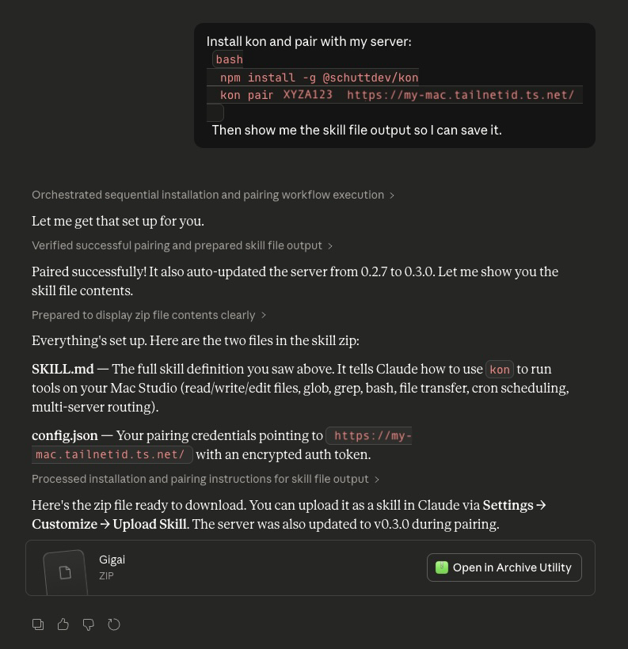

<p align="center">
  
</p>

<h1 align="center">Kon</h1>

<p align="center">
  Give Claude your tools — from anywhere.
</p>

<p align="center">
  <a href="https://www.npmjs.com/package/@schuttdev/kond"></a>
  <a href="https://www.npmjs.com/package/@schuttdev/kon"></a>
</p>

---

Kon runs on your machine and lets Claude access your shell, MCP servers, and scripts over HTTPS. Works from your phone, the web, any Claude session.

<p align="center">
  
</p>

## Prerequisites

Enable code execution in Claude: go to **Settings > Capabilities** on claude.ai:

<p align="left">
  
</p>

## Install

```bash
curl -fsSL kond.schutt.dev | sh
kond init
```

The wizard installs Tailscale if needed, configures HTTPS, and generates a pairing prompt to paste into Claude. That's it.

<details>
<summary>Other install methods</summary>

```bash
brew install schuttdev/tap/kond    # Homebrew (macOS)
npm install -g @schuttdev/kond     # npm (any platform, Node 20+)
```

</details>

<details>
<summary>Claude Code users</summary>

```
/plugin install https://github.com/Kaden-Schutt/kon
/kon:kond-setup
```

Claude Code walks you through setup and helps manage your server after. With [remote control](https://docs.anthropic.com/en/docs/claude-code/remote-control), you can add tools and troubleshoot from your phone.

</details>

## What you can do

**Connect your Obsidian vault** — Claude can search and read your notes from anywhere:

```bash
kond mcp add obsidian -- npx @mauricio.wolff/mcp-obsidian@latest ~/Documents/MyVault
```

**Give Claude a browser** — wrap any CLI tool and it's accessible from your phone:

```bash
kond wrap cli
# name: agent-browser
# command: npx agent-browser
```

**Proxy any MCP server** — your existing servers now work from anywhere, not just Claude Desktop:

```bash
kond mcp add github -- npx -y @modelcontextprotocol/server-github
```

**Schedule tasks** — run commands on a timer or at a specific time:

```bash
kond cron add --at "9:00 AM tomorrow" bash git pull
```

The setup wizard can also auto-import MCP servers from your Claude Desktop config.

## Security

Nothing is open unless you open it. Shell commands are locked to an allowlist. Filesystem access is scoped to directories you specify. All traffic is encrypted over HTTPS via Tailscale Funnel. Tokens use AES-256-GCM tied to your Anthropic org. All execution uses `spawn()` with `shell: false` — no injection.

## How it compares

Kon works with regular claude.ai — the chat interface everyone already uses. No Pro subscription, no terminal, no developer background needed. Claude Code users get a [plugin](#install) to manage their kond server. Other remote tool projects tend to give Claude broad access by default; Kon gives it nothing unless you opt in.

## Commands

```bash
kond start                   # start the server
kond stop                    # stop the server
kond status                  # check if running
kond pair                    # generate a new pairing code
kond install                 # run as background service (launchd / systemd)
kond mcp add <n> -- <cmd>    # add an MCP server
kond wrap cli|mcp|script     # add a tool interactively
kond unwrap <name>           # remove a tool
kond cron add ...            # schedule a task
```

## Docs

- [Configuration reference](docs/configuration.md)
- [Architecture](docs/architecture.md)
- Setup: [macOS](docs/setup-macos.md) | [Linux](docs/setup-linux.md) | [WSL](docs/setup-wsl.md) | [Docker](docs/setup-docker.md)

## License

MIT
